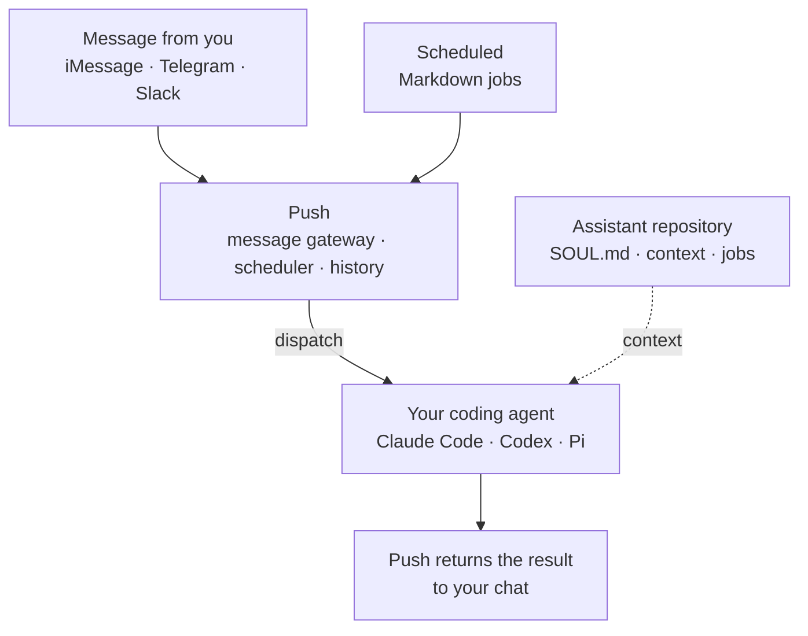

<div align="center">

# Push

### Turn your coding agent into a 24/7 personal assistant.

Message Claude Code, Codex, or Pi from your phone. Schedule work for later.
Keep the agent and its data on your own machine.

[](https://github.com/owainlewis/push/actions/workflows/ci.yml)
[](https://owainlewis.github.io/push/)
[](LICENSE)

[Get started](#get-started) · [Read the docs](https://owainlewis.github.io/push/) · [View releases](https://github.com/owainlewis/push/releases)

</div>

## Website

https://pushassistant.com/

## Examples

Email triage: https://github.com/owainlewis/push/blob/main/examples/assistant/jobs/daily-inbox-triage.md

## The mission

Good coding agents should be useful beyond an open terminal.

Push makes the agent you already trust available through iMessage, Telegram,
or Slack. It can answer a message, continue a conversation, or run a Markdown
job on a schedule. Give it clear context and a useful set of jobs, and it can
act as your AI chief of staff. Your assistant files stay in a Git repository
you own.

Push is a small bridge, not a new agent. Your coding agent still controls the
models, tools, permissions, and reasoning.

## A simpler alternative

[OpenClaw](https://github.com/openclaw/openclaw) and
[Hermes Agent](https://github.com/NousResearch/hermes-agent) are powerful
assistant platforms with their own agent runtimes, tools, skills, memory, and
messaging layers.

Push does not replace your agent. One small Rust binary adds messaging and
schedules to Claude Code, Codex, or Pi.

## How it works



## What it does

- Runs on your Mac or Linux machine
- Connects private iMessage, Telegram, and Slack chats
- Uses your existing Claude Code, Codex, or Pi setup
- Keeps conversations and job history between restarts
- Runs one-off or scheduled Markdown jobs
- Opens no inbound network port

## Get started

You need Apple Silicon macOS or x86_64 Linux, Git, and one supported coding
agent installed and signed in. iMessage requires macOS.

Install the latest release:

```sh
curl -fsSL https://raw.githubusercontent.com/owainlewis/push/main/install.sh | sh
```

The binary goes to `~/.local/bin`. If your shell cannot find `push`, add that
directory to `PATH` before continuing.

Create a Git-backed home for your assistant:

```sh
push init ~/Code/assistant
```

This creates a Git repository containing `SOUL.md`, shared instructions in
`AGENTS.md`, a `CLAUDE.md` reference to those instructions, `context/`, `evals/`,
and `jobs/`, then records its path in `~/.push/config.toml`.

Edit `~/.push/config.toml` to connect a chat channel. A small Telegram setup
looks like this:

```toml
channel = "telegram"
agent = "codex"
assistant_root = "~/Code/assistant"

[telegram]
bot_token = "token-from-BotFather"
allow_user_ids = [123456789]
```

Check the setup and start Push:

```sh
push doctor
push
```

For channel setup, assistant design, service installation, jobs, permissions,
and every config option, follow the
[developer docs](https://owainlewis.github.io/push/).

## Build from source

Install the stable Rust toolchain, then run:

```sh
git clone https://github.com/owainlewis/push.git
cd push
cargo build --locked --release
```

The binary will be at `target/release/push`. See the
[contributing guide](CONTRIBUTING.md) for development checks and documentation
setup.

## Open source

Push is early software. Please read the [security policy](SECURITY.md) before
reporting a vulnerability. Bug reports, ideas, and pull requests are welcome.

- [Contributing](CONTRIBUTING.md)
- [Code of conduct](CODE_OF_CONDUCT.md)
- [Security policy](SECURITY.md)
- [MIT license](LICENSE)
