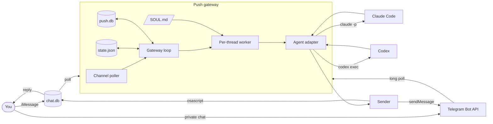
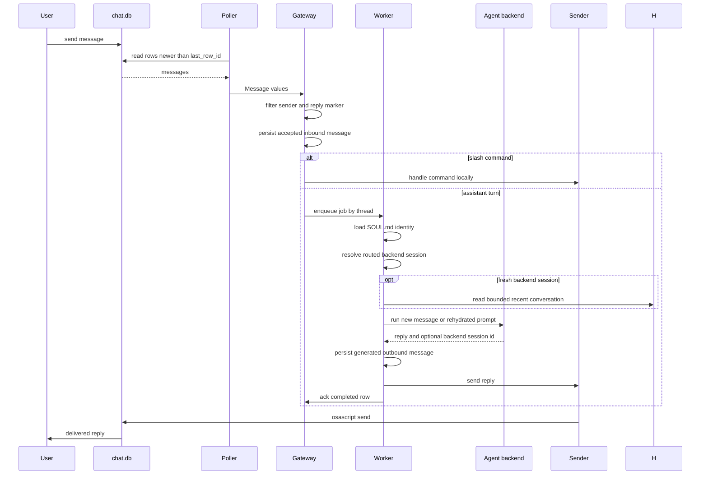

# Push Architecture

Push is one local Rust process. It polls one or more configured iMessage and
Telegram channels, filters messages,
loads the assistant identity, runs a configured agent backend, and sends the
final reply.

The important boundary is not iMessage or Claude. The important boundary is:

```text
message gateway -> agent backend -> message gateway
```

The gateway owns the personal assistant state. The backend owns execution.

## Principles

### 1. Gateway First

Push is a messaging gateway for a personal assistant. It should stay small and
own the durable pieces:

- channels
- allowlists
- routing
- assistant identity
- canonical conversation history
- validated runbook jobs and their durable run ledger
- cursor and backend-session state
- delivery

### 2. Runtime Disposable

Agent runtimes are replaceable. Claude Code and Codex are the first adapters.
More can be added without changing the messaging core.

The gateway should not build:

- its own agent loop
- its own plugin system
- its own MCP layer
- its own coding workflow
- its own tool runner

Those belong to the selected backend.

### 3. Polling Only

Push polls channel state and shells out to local agent commands. It opens no
server port and accepts no inbound network connection. Telegram uses outbound
HTTPS long polling.

The trust boundary is the messaging account plus the configured channel
allowlist.

## System Overview



## Message Lifecycle



## Backend Boundary

The gateway calls an agent through this internal shape:

```rust
Request {
    session_id,
    is_new,
    work_dir,
    instructions,
    prompt,
}

RunOutput {
    reply,
    session_id,
}
```

That keeps the gateway independent of backend-specific mechanics.

Normal resumed turns contain only the new request. Fresh sessions use at most
20 prior messages from the exact channel-qualified conversation. Push caps each
historical message at 4 KiB and the history block at 16 KiB, then JSON-delimits
roles and content before appending the current user message. This transcript is
prompt content; `SOUL.md` remains separate instruction context. A recognized
missing-session error rotates the stored backend session and retries once with
rehydration. Audit metadata records the rehydrated message count.

### Claude Code Adapter

Claude Code lets Push choose the session id.

- New conversation: `claude -p --session-id <uuid>`
- Existing conversation: `claude -p --resume <uuid>`
- Identity: `--append-system-prompt <SOUL.md + gateway invariants>`
- Work dir: per-thread sandbox dir

### Codex Adapter

Codex creates its own thread id.

- New conversation: `codex exec --json ...`
- Existing conversation: `codex exec resume <thread_id> ...`
- Identity: `-c developer_instructions=<SOUL.md + gateway invariants>`
- Work dir: per-thread sandbox dir on the first run

The adapter reads Codex JSONL events to capture `thread.started.thread_id` and
stores that id for future turns.

## State Model

`state.json` stores channel-specific cursors and channel-qualified sessions:

```json
{
  "last_row_id": 123,
  "cursors": {
    "imessage": 123,
    "telegram": 456
  },
  "sessions": {
    "imessage:self:you@icloud.com": {
      "uuid": "backend-session-id",
      "started": true,
      "backend": "codex"
    }
  }
}
```

`last_row_id` remains for compatibility with old iMessage state files. The
field named `uuid` also remains for compatibility, but it
now means "backend session id".

If the configured backend changes for a thread, Push starts a fresh backend
session instead of trying to resume the old runtime's session.

With advanced `channels = ["imessage", "telegram"]` configuration, one
coordinator starts an independent polling loop, acknowledgement tracker, and
thread queue map for each enabled provider. The loops share one locked state
store, canonical history database, backend runner set, and serialized audit log.
One provider can fail or rate-limit without cancelling the other. A shared
shutdown signal cancels pending polls and lets every channel drain its workers.
Replies remain bound to the originating loop and exact target.

Optional `primary_delivery` selects one enabled, allowlisted channel target for
proactive output. Resolution is lazy: an absent or invalid primary returns a
scoped error to the proactive caller without affecting reply polling.

When primary delivery resolves, the gateway also runs the cron scheduler. It
evaluates validated five-field triggers against their IANA timezone, enqueues at
most one occurrence after an in-process clock jump, and initializes future-only
occurrences after restart so downtime is never caught up. A configured worker
limit bounds fresh-session job execution. Scheduled and manual processes share
the per-job advisory lock and SQLite active-run uniqueness boundary.

Scheduled output or bounded failure detail is committed before notification.
Delivery has its own persisted state and is retried up to three times from that
stored result. Restart recovery resumes queued work and pending delivery, but
never reruns a backend run that had already started. A running row is marked
interrupted only after the released advisory lock proves its executor is gone.

`push.db` stores channel-qualified conversations and their inbound and outbound
messages. Accepted inbound messages are inserted before gateway commands or
backend dispatch. Generated backend, command, and error replies are inserted
before delivery, with generation and delivery state tracked separately. A
unique channel event ID makes inbound retries idempotent, and a unique link from
each inbound message to its outbound response preserves the generation/delivery
crash boundary. SQLite history does not replace `state.json` cursors or backend
session IDs in this phase.

The same database stores immutable job-run claims and bounded terminal results.
Markdown runbooks remain operator-owned files under `jobs_dir`. A manual CLI
start rereads and validates the exact file, acquires a non-blocking per-job lock,
then records and claims the run in one immediate SQLite transaction before
spawning a fresh backend session. The CLI holds the lock through result
persistence. Only a process that acquired the released lock may fail a stale
manual claim, so a live local executor is never reclaimed from ledger state
alone. Manual runs do not reuse chat history or backend session ids.

The same database stores `ask_user` questions before delivery. Each question
has a UUID correlation id, two to nine bounded choices, an expiry, delivery
state, and an exact channel, sender, chat, and thread/topic binding. Inbound
numbered replies pass the normal allowlist first, then resolve transactionally
to one normalized value. The workflow consumes an answer at most once. Pending
questions survive restart; cancellation and expiry are terminal, and rejected
or duplicate answer attempts are audited without reaching a backend session or
the rehydrated conversation transcript. Workflows can poll the durable question
state and consume an answered value once; crossing the expiry first records an
expired terminal state, so later cancellation cannot overwrite the timeout.

Agent-written job proposals live separately under identity-specific inboxes in
`drafts_dir`. Route backends receive only their exact inbox as an additional
writable root under contained
permission profiles; full-access routes and jobs are rejected. Push snapshots
and validates a changed regular file, stores its exact bytes, hash, proposer,
and bound approval question in SQLite, then sends the full proposal to the
originating channel. Reconciliation also runs after backend failure or timeout
and before replaying a persisted outbound reply, so a crash cannot orphan an
unrecorded revision. Approval rechecks the path, symlink status, revision, job
schema, protected work directory, and configured permission ceiling. A valid
stored revision is staged inside `jobs_dir` and installed with an atomic
no-clobber link. Rejection and revision mismatch never activate the draft, and
consumed or duplicate answers cannot repeat installation.

`audit_log_path` stores a local JSONL event stream for production debugging.
Audit events record message metadata, routing decisions, approval outcomes,
backend run starts and failures, reply delivery metadata, and row completion.
Message and reply text are redacted by default; `audit_log_content` opts into
content logging.

## Assistant Identity

Push loads only `SOUL.md` from `assistant_dir`, which defaults to `~/.push`.
The gateway appends invariants in memory without changing the file, then injects
the result at instruction priority. Missing `SOUL.md` means no custom identity;
backend runs continue with the gateway invariants. The backend still owns how
tools, skills, MCP, repo context, and permissions work.

## Concurrency

One worker task exists per conversation thread. Messages in the same thread run
in order. Different threads can run in parallel.

This prevents two messages in the same conversation from racing against the same
backend session.

## Security Posture

An allowed inbound message can cause an agent to run tools. The sender filter is
the trust boundary. iMessage uses `imessage.self_handles` and
`imessage.allow_from`; Telegram uses stable numeric `telegram.allow_user_ids`
and `telegram.allow_chat_ids`.

Routes select a named Push permission profile. `restricted` is the default and
jobs may use only explicitly allow-listed profile names. Push rejects
`full-access` for routes and jobs because backend bypass modes cannot protect
Push-owned files. Claude receives a fixed tool allowlist and denies Bash;
Codex receives `read-only` or `workspace-write`. Claude does not provide a
Codex-equivalent filesystem sandbox, so its `workspace` mapping permits file
tools but deliberately omits shell access. Custom profiles select a capability,
not raw backend flags.

## Extension Points

The next extension points should be added in this order:

1. More agent adapters.
2. More channels.
3. Memory write-back with audit and review.
4. Per-task backend routing.

Avoid adding a gateway plugin system until there is a specific capability that
cannot live in the selected backend.
