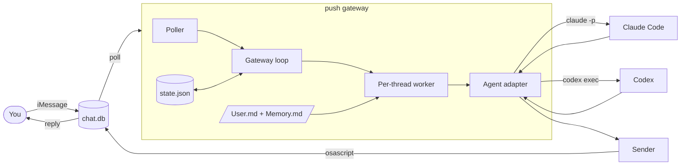
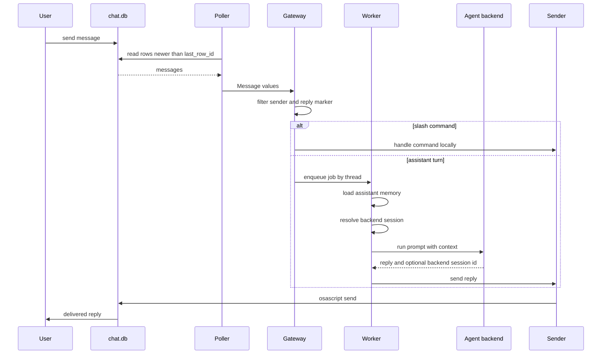

# push Architecture

push is one local Rust process. It polls Messages, filters messages, loads the
assistant context, runs a configured agent backend, and sends the final reply.

The important boundary is not iMessage or Claude. The important boundary is:

```text
message gateway -> agent backend -> message gateway
```

The gateway owns the personal assistant state. The backend owns execution.

## Principles

### 1. Gateway First

push is a messaging gateway for a personal assistant. It should stay small and
own the durable pieces:

- channels
- allowlists
- routing
- assistant config
- memory loading
- conversation state
- delivery

### 2. Runtime Disposable

Agent runtimes are replaceable. Claude Code and Codex are the first adapters.
More can be added without changing the messaging core.

The gateway should not build:

- its own agent loop
- its own plugin system
- its own MCP layer
- its own coding workflow
- its own tool runner

Those belong to the selected backend.

### 3. Polling Only

push reads local message state and shells out to local commands. It opens no
server port and accepts no inbound network connection.

The trust boundary is the messaging account plus the configured allowlist.

## System Overview



## Message Lifecycle



## Backend Boundary

The gateway calls an agent through this internal shape:

```rust
Request {
    session_id,
    is_new,
    work_dir,
    system_append,
    prompt,
}

RunOutput {
    reply,
    session_id,
}
```

That keeps the gateway independent of backend-specific mechanics.

### Claude Code Adapter

Claude Code lets push choose the session id.

- New conversation: `claude -p --session-id <uuid>`
- Existing conversation: `claude -p --resume <uuid>`
- Memory: `--append-system-prompt <User.md + Memory.md>`
- Work dir: per-thread sandbox dir

### Codex Adapter

Codex creates its own thread id.

- New conversation: `codex exec --json ...`
- Existing conversation: `codex exec resume <thread_id> ...`
- Memory: included in the prompt wrapper
- Work dir: per-thread sandbox dir on the first run

The adapter reads Codex JSONL events to capture `thread.started.thread_id` and
stores that id for future turns.

## State Model

`state.json` stores:

```json
{
  "last_row_id": 123,
  "sessions": {
    "self:you@icloud.com": {
      "uuid": "backend-session-id",
      "started": true,
      "backend": "codex"
    }
  }
}
```

The field is still named `uuid` for compatibility with old state files, but it
now means "backend session id".

If the configured backend changes for a thread, push starts a fresh backend
session instead of trying to resume the old runtime's session.

## Assistant Context

push loads:

- `assistant/User.md`
- `assistant/Memory.md`

This context is human-owned markdown. The gateway injects it into the selected
backend, but the backend still owns how tools, skills, MCP, repo context, and
permissions work.

## Concurrency

One worker task exists per conversation thread. Messages in the same thread run
in order. Different threads can run in parallel.

This prevents two messages in the same conversation from racing against the same
backend session.

## Security Posture

An allowed inbound message can cause an agent to run tools. The allowlist is the
main control.

Backend permissions are adapter-specific:

- Claude Code currently defaults to `bypassPermissions` for headless use.
- Codex currently defaults to `workspace-write` with approval policy `never`.

Both should be treated as powerful local automation. Use broader modes only in
environments you control.

## Extension Points

The next extension points should be added in this order:

1. More agent adapters.
2. Per-thread or per-task backend routing.
3. More channels.
4. Memory write-back with audit and review.

Avoid adding a gateway plugin system until there is a specific capability that
cannot live in the selected backend.
