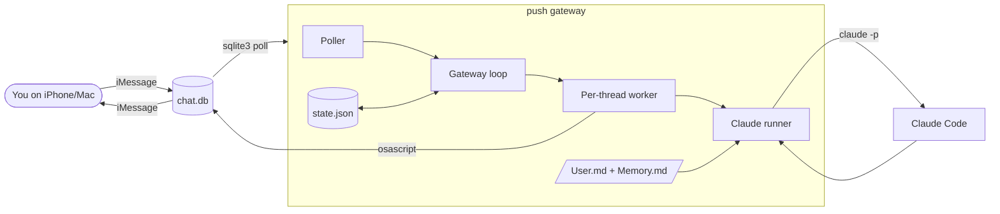
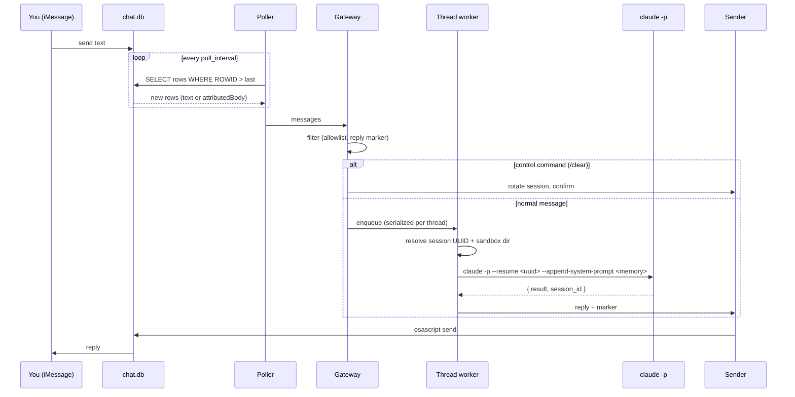
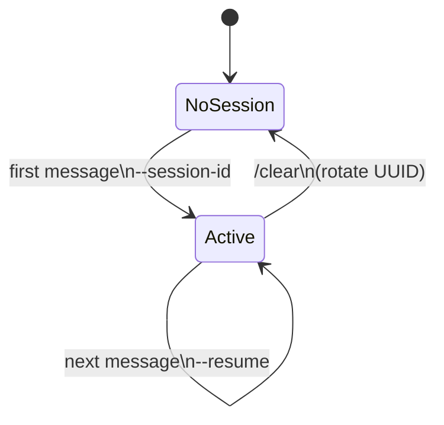
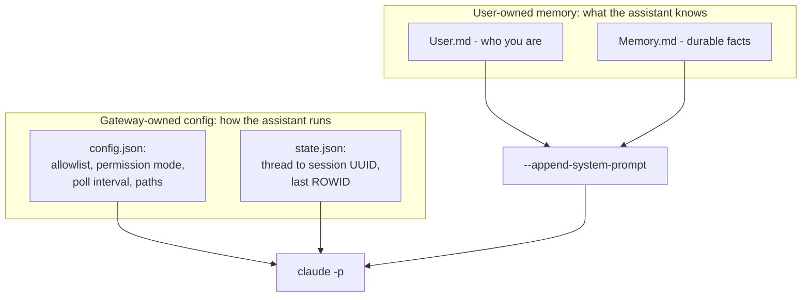
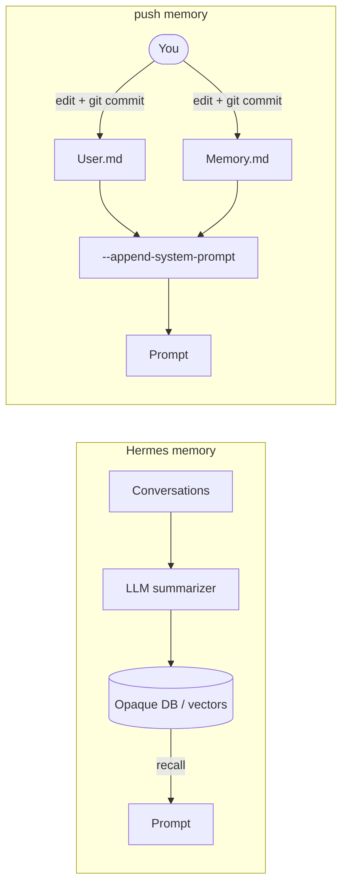
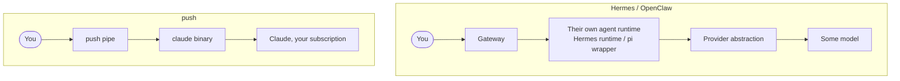
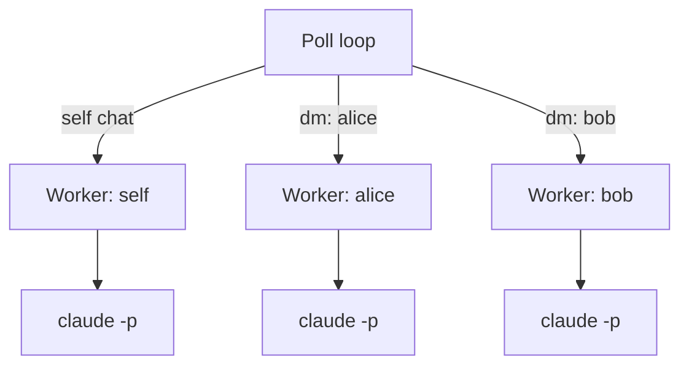

# push — Architecture

This doc explains how push is put together and, more importantly, *why* we made
the memory and config choices we did, and how they differ from Hermes.

## System overview

push is a single Go process on your Mac. It reads incoming iMessages from the
local Messages database, runs each through the Claude Code CLI, and texts the
reply back. No server, no database, no cloud.

## Message lifecycle

## Session model

Each conversation maps to a stable Claude Code session UUID that the gateway
owns. The first message uses `--session-id <uuid>`; every message after uses
`--resume <uuid>`. We let Claude Code keep the transcript (including tool-call
state) instead of rebuilding conversation memory ourselves.

`/clear` just generates a new UUID. The old transcript stays on disk, unused, as
a free audit trail.

## Two kinds of state, kept separate

This is the core design decision, so it gets its own picture.

- **Config** is operational: who may message, what permission mode, where files
  live, how often to poll. It belongs to the gateway. You rarely touch it.
- **Memory** is content: who you are and what the assistant should always know.
  It is plain markdown you own and edit. It rides into every run via
  `--append-system-prompt`, which appends to Claude Code's default system prompt
  rather than replacing it.

Keeping these apart means you can hand-edit what the assistant knows without
touching how it runs, and version the two independently.

## Memory: why files beat a memory database

Hermes stores memory as opaque state: Honcho dialectic user modeling plus FTS5
session search with LLM summarization. It is powerful, but you cannot open it,
read it, or correct a single wrong fact by hand. push takes the opposite bet.

Why this is better for a single-user personal assistant:

| Property | Hermes | push |
|---|---|---|
| **Legible** | No — DB rows / vectors | Yes — it is markdown you read |
| **Correctable** | Re-prompt and hope | Open the file, fix the line |
| **Versioned** | No | Git, with full history and blame |
| **Portable** | Tied to its store | Copy two files anywhere |
| **Injection** | Custom recall pipeline | Native Claude Code context loading |
| **Auditable** | Opaque | A diff shows exactly what changed |

The trade-off is honest: file memory does not do automatic semantic recall over
thousands of past sessions. For one person's assistant that is a feature, not a
gap — you want a small, curated, trustworthy context, not a sprawling vector
store you cannot inspect. When scale memory is needed later, it can be added
behind the same `--append-system-prompt` seam without changing anything else.

## Why Claude Code instead of the raw API

Claude Code already solves the parts a gateway would otherwise reimplement:
session persistence and resume, tool execution, permission modes, and context
loading (`CLAUDE.md`, `--append-system-prompt`). By shelling out to `claude -p`,
push stays tiny and inherits all of that. The cost is one process per message;
for a personal assistant that is fine.

## No third-party agent layer

This is push's main positioning. push has no agent loop of its own. It is a pipe
to the real `claude` binary, so the assistant you text *is* Claude Code: same
model, tools, MCP servers, permission modes, context loading, and login.

The competing gateways interpose an agent they wrote between you and the model:
Hermes runs its own runtime across many providers; OpenClaw wraps the
third-party `pi` agent. That layer looks like flexibility but is a liability —
you inherit their agent loop, their bugs, and their model choices, and you lag
whatever Anthropic ships in Claude Code itself. push inherits nothing because it
wraps nothing. It runs `claude` and relays the answer.

Practical consequences:

- **Billing**: push runs `claude` with your environment, so it uses your Claude
  subscription. No separate API account, no provider keys. (If
  `ANTHROPIC_API_KEY` is set it honors that; otherwise the subscription login.)
- **Features for free**: skills, MCP, permission modes, `CLAUDE.md` — anything
  Claude Code gains, push gains the same day with no code change.
- **One source of truth**: there is no second agent implementation to keep in
  sync with the real one.

## Concurrency

One worker goroutine per thread, fed by a buffered channel. Messages within a
thread run strictly in order, so two quick texts never launch two `claude`
processes against the same transcript at once. Different threads run in
parallel.

## Extending to other channels

The poller and sender are concrete today (iMessage only, per the v1 scope), but
the gateway depends only on a `Message` value and a send call. A second channel
(Telegram) becomes a new poller/sender pair feeding the same loop, store, and
memory injection. Nothing in the session or memory design is iMessage-specific.

## Security posture

push runs Claude Code with `--permission-mode bypassPermissions` because a
headless run has no human to approve tool calls. Each thread runs in its own
sandbox directory under `sessions/`. The real control is the allowlist: an
inbound text is an instruction to an agent with tool access, so only trusted
senders should ever be allowed. See the PRD for the full filtering rules.
