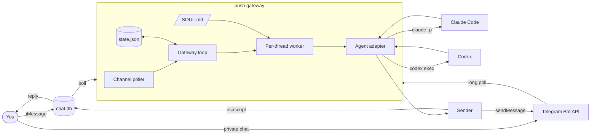
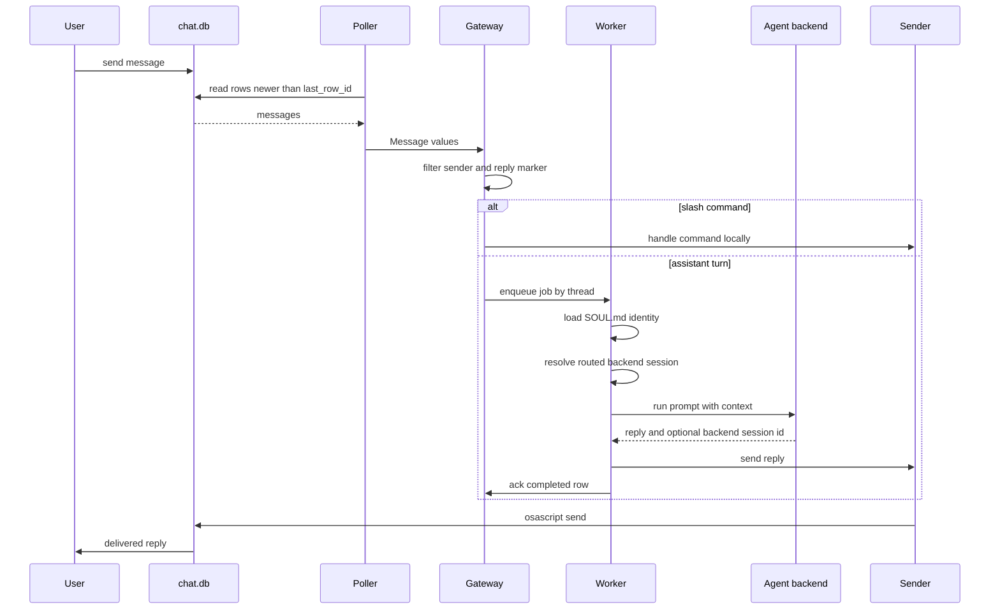

# push Architecture

push is one local Rust process. It polls iMessage or Telegram, filters messages,
loads the assistant identity, runs a configured agent backend, and sends the
final reply.

The important boundary is not iMessage or Claude. The important boundary is:

```text
message gateway -> agent backend -> message gateway
```

The gateway owns the personal assistant state. The backend owns execution.

## Principles

### 1. Gateway First

push is a messaging gateway for a personal assistant. It should stay small and
own the durable pieces:

- channels
- allowlists
- routing
- assistant identity
- conversation state
- delivery

### 2. Runtime Disposable

Agent runtimes are replaceable. Claude Code and Codex are the first adapters.
More can be added without changing the messaging core.

The gateway should not build:

- its own agent loop
- its own plugin system
- its own MCP layer
- its own coding workflow
- its own tool runner

Those belong to the selected backend.

### 3. Polling Only

push polls channel state and shells out to local agent commands. It opens no
server port and accepts no inbound network connection. Telegram uses outbound
HTTPS long polling.

The trust boundary is the messaging account plus the configured channel
allowlist.

## System Overview



## Message Lifecycle



## Backend Boundary

The gateway calls an agent through this internal shape:

```rust
Request {
    session_id,
    is_new,
    work_dir,
    instructions,
    prompt,
}

RunOutput {
    reply,
    session_id,
}
```

That keeps the gateway independent of backend-specific mechanics.

### Claude Code Adapter

Claude Code lets push choose the session id.

- New conversation: `claude -p --session-id <uuid>`
- Existing conversation: `claude -p --resume <uuid>`
- Identity: `--append-system-prompt <SOUL.md + gateway invariants>`
- Work dir: per-thread sandbox dir

### Codex Adapter

Codex creates its own thread id.

- New conversation: `codex exec --json ...`
- Existing conversation: `codex exec resume <thread_id> ...`
- Identity: `-c developer_instructions=<SOUL.md + gateway invariants>`
- Work dir: per-thread sandbox dir on the first run

The adapter reads Codex JSONL events to capture `thread.started.thread_id` and
stores that id for future turns.

## State Model

`state.json` stores channel-specific cursors and channel-qualified sessions:

```json
{
  "last_row_id": 123,
  "cursors": {
    "imessage": 123,
    "telegram": 456
  },
  "sessions": {
    "imessage:self:you@icloud.com": {
      "uuid": "backend-session-id",
      "started": true,
      "backend": "codex"
    }
  }
}
```

`last_row_id` remains for compatibility with old iMessage state files. The
field named `uuid` also remains for compatibility, but it
now means "backend session id".

If the configured backend changes for a thread, push starts a fresh backend
session instead of trying to resume the old runtime's session.

`audit_log_path` stores a local JSONL event stream for production debugging.
Audit events record message metadata, routing decisions, backend run starts and
failures, reply delivery metadata, and row completion. Message and reply text
are redacted by default; `audit_log_content` opts into content logging.

## Assistant Identity

push loads only `SOUL.md` from `assistant_dir`, which defaults to `~/.push`.
The gateway appends invariants in memory without changing the file, then injects
the result at instruction priority. Missing `SOUL.md` means no custom identity;
backend runs continue with the gateway invariants. The backend still owns how
tools, skills, MCP, repo context, and permissions work.

## Concurrency

One worker task exists per conversation thread. Messages in the same thread run
in order. Different threads can run in parallel.

This prevents two messages in the same conversation from racing against the same
backend session.

## Security Posture

An allowed inbound message can cause an agent to run tools. The sender filter is
the trust boundary. iMessage uses `imessage.self_handles` and
`imessage.allow_from`; Telegram uses stable numeric `telegram.allow_user_ids`
and `telegram.allow_chat_ids`.

Backend permissions are adapter-specific:

- Claude Code currently defaults to `bypassPermissions` for headless use.
  `claude_tools` controls the available Claude Code tool set.
  `claude_allowed_tools` and `claude_disallowed_tools` pass permission allow
  and deny rules through to Claude Code.
- Codex currently defaults to `workspace-write` with approval policy `never`.

Both should be treated as powerful local automation. Use broader modes only in
environments you control.

## Extension Points

The next extension points should be added in this order:

1. More agent adapters.
2. More channels.
3. Memory write-back with audit and review.
4. Per-task backend routing.

Avoid adding a gateway plugin system until there is a specific capability that
cannot live in the selected backend.
